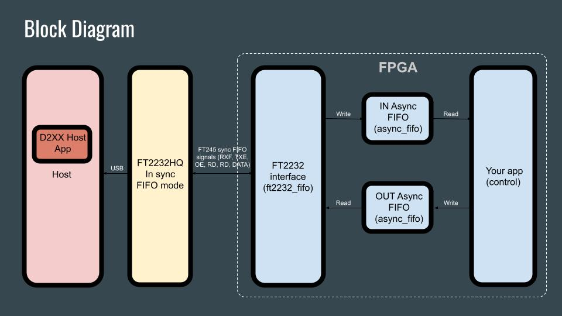

# ECP5/FT2232HQ Software & Hardware
This project implements a High Speed USB device using a FT2232HQ operating in synchronous FIFO mode coupled with a Lattice Semiconductor ECP5 FPGA. 

## Software
Read all the details of the bring-up steps and test code in the [Wiki](https://github.com/gildobjanschi/ECP5_BGA381_FT2232HQ_FIFO/wiki).

The bring-up Verilog software is located in the [/hdl_loopback](https://github.com/gildobjanschi/ECP5_BGA381_FT2232HQ_FIFO/tree/main/hdl_loopback) directory. The bring-up host application that interfaces to the D2XX FTDI driver can be found in the [/host_loopback](https://github.com/gildobjanschi/ECP5_BGA381_FT2232HQ_FIFO/tree/main/host_loopback) directory. The full test code that implements the modules in the block diagram depiced above is implemented in the [/hdl_test](https://github.com/gildobjanschi/ECP5_BGA381_FT2232HQ_FIFO/tree/main/hdl_test) and [/host_test](https://github.com/gildobjanschi/ECP5_BGA381_FT2232HQ_FIFO/tree/main/host_test) respectively.

The diagram below will help you understand the software architecture and navigate the Verilog and C source code a bit easier.

## Hardware
The board is fully functional. An [extension board](https://github.com/gildobjanschi/ECP5_BGA381_FT2232HQ_FIFO_EXT) was developed to help validate the design.

[Schematic PDF](https://github.com/gildobjanschi/ECP5_BGA381_FT2232HQ_FIFO/blob/main/kicad/ECP5.pdf)

